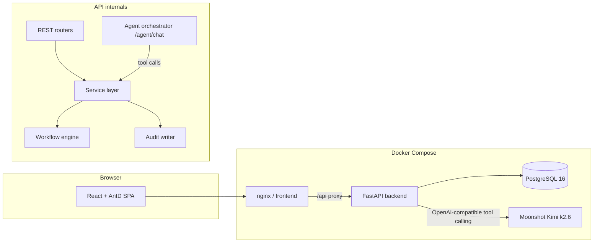
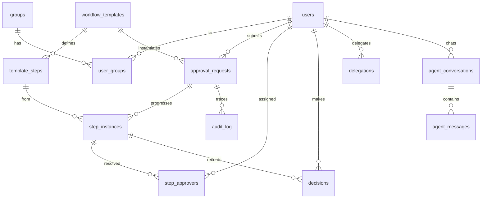

# Architecture Design — Approval Workflow Engine

_Response to `Approval_Workflow_Case_Study_Agentic.pdf`. Designed 2026-07-02._

## 1. Goals

Build a generic, reusable approval workflow engine that supports multiple business
use cases (expense reports, purchase orders, time-off, …) without hardcoding each
process, plus an AI assistant that lets users drive the whole system through natural
language.

Core capabilities (from the case study):

1. Dynamic workflow definition — multi-step approval workflows with conditional routing
2. Request submission with metadata
3. Decision making — approve / reject / request changes, with comments
4. Delegation — temporary delegation of approval authority
5. Audit trail — complete history of all actions
6. Agentic interaction — AI assistant driving the system through tool calls

## 2. Tech Stack & Third-Party Choices

| Concern | Choice | Why |
|---|---|---|
| Backend | **FastAPI** (Python 3.12) | Required by brief. Auto-generated OpenAPI docs satisfy the "API documentation" requirement for free. |
| Database | **PostgreSQL 16** | Approval data is inherently relational (templates → steps → instances → decisions) and needs transactional integrity for concurrent approvals. JSONB columns give schema flexibility for request metadata and step conditions without sacrificing queryability. SQLite/Mongo rejected: no strong concurrent-write story / poor relational fit for audit + joins. |
| ORM / migrations | **SQLAlchemy 2.0 + Alembic** | Industry standard; migrations are a submission deliverable. |
| Auth | **PyJWT + bcrypt** | JWT bearer tokens; small, boring, auditable. Heavier frameworks (fastapi-users) bring account flows we don't need for this scope. |
| AI model | **Kimi `kimi-k2.6` via the official `openai` SDK** | Moonshot exposes an OpenAI-compatible API, so the `openai` client pointed at the Moonshot base URL gives us chat + native tool-calling with zero custom HTTP code. This is the single biggest code-saver for Part 3. |
| LLM retries | **tenacity** | Declarative retry/backoff around model calls (Observability: "failures and retries"). |
| Frontend | **React 18 + Vite + TypeScript + Ant Design 5** | AntD ships tables, forms, modals, timelines and a chat-friendly component set — the approval inbox/dashboard is mostly configuration instead of hand-built components. |
| Orchestration | **Docker Compose** | Required: `db` + `backend` + `frontend` (nginx serving the built SPA, proxying `/api`). |

**Deliberate non-choice — workflow engines (Temporal, Camunda, SpiffWorkflow):** Part 1
explicitly asks us to *design* the schema (templates, steps, conditions, delegations,
audit) and explain it. Outsourcing state to an external engine would bypass the core of
the exercise, add a heavyweight dependency, and split the audit trail across two systems.
The routing logic itself (~200 lines) is small compared to the integration cost.
For the agent, we use direct `openai` tool-calling rather than LangChain/LangGraph:
one dependency, a transparent loop we can log step-by-step (observability requirement),
and no framework abstractions hiding authorization checks.

## 3. System Overview

Key rule: **the agent never touches the database directly.** Its tools call the same
service layer as the REST endpoints, under the identity of the authenticated user, so
every permission check and audit write applies identically to both paths.

## 4. Data Model (Part 1)

### Tables

- **users** — id, email, name, password_hash, role (`admin|manager|finance|vp|employee`), is_active.
- **groups** / **user_groups** — named approver pools (e.g. "Finance Team").
- **workflow_templates** — id, name, description, category, `fields` JSONB (declared
  input fields the UI/agent must collect), is_active, version, created_by. Templates are
  immutable once used; edits create a new version (old instances keep their definition).
- **template_steps** — id, template_id, step_order, name,
  `approver_type` (`user|group|role`), approver_user_id / approver_group_id / approver_role,
  `approval_mode` (`any|all` — quorum for parallel/group approval),
  `condition` JSONB (e.g. `{"field":"amount","op":">","value":10000}`; step is skipped when
  false → **conditional routing**), `sla_hours` + escalation target (**escalation rules**).
- **approval_requests** (workflow instances) — id, template_id, requester_id, title,
  amount, `data` JSONB, status (`pending|approved|rejected|changes_requested|cancelled`),
  current_step_order, timestamps.
- **step_instances** — one per non-skipped template step per request: status
  (`pending|active|approved|rejected|skipped`), activated_at, due_at, escalated flag.
- **step_approvers** — the approver authorities *resolved at activation time* (group
  members / role holders expanded to concrete users). This snapshot makes "who could
  approve and why" auditable even if groups change later. Delegation is resolved at
  *decision time* instead, so delegations created after a step activates still apply.
- **decisions** — step_instance_id, request_id, approver_id (on whose authority),
  acting_user_id (who clicked — differs under delegation), decision, comment, created_at.
- **delegations** — delegator, delegate, starts_at/ends_at window, active flag, reason.
- **audit_log** — append-only: actor, action, entity type/id, request_id, `details` JSONB,
  timestamp. Written by the service layer so REST and agent actions are captured uniformly.
- **agent_conversations / agent_messages** — persisted multi-turn history including every
  tool invocation (name, arguments, result, latency, error) → agent observability.

### Indexes (high-traffic paths)

- `step_approvers(approver_id, status)` — inbox query.
- `approval_requests(requester_id)`, `(status)`, `(template_id)`.
- `step_instances(request_id)`, `(status, due_at)` — escalation sweep.
- `audit_log(request_id, created_at)`, `decisions(request_id)`.
- `delegations(delegator_id)`, `(delegate_id)` partial on active window.

### Engine semantics

- **Submit**: validate data against template `fields` → create request → walk steps in
  order, evaluate each `condition` against request data (`amount` merged in); steps whose
  condition is false are recorded as `skipped`; the first applicable step is activated.
- **Requester-role skip** (product clarification 2026-07-03): a step whose approver
  target is the requester's own *role* is also skipped — the standard chain is
  manager → finance → vp, so a manager's request starts at finance. Admin accounts
  cannot submit requests at all.
- **Activate step**: resolve approver_type to concrete users (the requester is excluded
  from approving their own request unless no one else can); set `due_at = now + sla_hours`.
- **Delegation**: at decision time a delegate may act on any pending authority of a
  delegator whose active window covers now; the decision records both whose authority
  was used and who actually acted.
- **Approve**: with `approval_mode=any` one approval completes the step; with `all`,
  every resolved approver must approve (parallel/group approval). Completion activates
  the next applicable step, or the request becomes `approved`.
- **Reject**: terminal — request `rejected` (any approver can reject in both modes).
- **Request changes**: request → `changes_requested`; the requester edits data and
  resubmits, which resets step instances and restarts routing.
- **Escalation**: a background sweep marks overdue active steps, adds the escalation
  target as an additional approver, and writes an audit entry.

## 5. API Design (Part 2)

All under `/api`, JWT bearer auth, JSON errors `{detail}`, list endpoints paginated
(`page`, `size` → `{items, total, page, size}`). Interactive docs at `/docs`.

| Area | Endpoints |
|---|---|
| Auth | `POST /auth/login`, `GET /auth/me` |
| Directory | `GET /users`, `GET /groups` |
| Workflow admin | `POST /templates` (admin), `GET /templates`, `GET /templates/{id}`, `PATCH /templates/{id}` (activate/deactivate) |
| Requests | `POST /requests`, `GET /requests?mine`, `GET /requests/{id}` (steps + decisions + audit), `POST /requests/{id}/cancel`, `POST /requests/{id}/resubmit` |
| Inbox | `GET /inbox` — active steps awaiting *me*, including delegated authority |
| Decisions | `POST /requests/{id}/decision` `{decision: approved\|rejected\|changes_requested, comment}` |
| Delegations | `POST /delegations`, `GET /delegations`, `DELETE /delegations/{id}` |
| Audit | `GET /audit?request_id=…` |
| Agent | `POST /agent/chat`, `GET /agent/conversations`, `GET /agent/conversations/{id}` (full trace incl. tool calls) |

**Authorization matrix (enforced in the service layer):** only `admin` manages templates;
any user submits requests; only resolved step approvers (or their active delegates) may
decide; requesters see their own requests; approvers see requests in their inbox; admins
see everything; audit access follows request visibility.

## 6. Agentic Assistant (Part 3)

`POST /agent/chat {conversation_id?, message}` → persisted multi-turn conversation.

**Orchestration loop** (plain `openai` SDK against Moonshot, model `kimi-k2.6`):

1. Build messages: system prompt (user identity, role, date, safety rules) + stored
   history + new user message.
2. Call Kimi with the tool schema; `tenacity` retries transient failures with backoff.
3. If the model returns tool calls → execute each against the service layer **as the
   authenticated user**, persist an `agent_messages` row per invocation (args, result,
   latency, error), feed results back; loop (max 8 iterations).
4. Persist and return the final assistant message plus the tool trace.

**Tools**: `list_workflow_templates`, `create_workflow_template`, `submit_request`,
`get_pending_approvals`, `get_request_details`, `decide_request` (approve/reject/request
changes), `create_delegation`, `get_audit_history`, `list_users_and_groups`.

**Authorization & safety**

- Tools run through the same service layer ⇒ RBAC cannot be bypassed by prompt injection;
  an unauthorized tool call returns a structured permission error the model relays.
- **Server-enforced confirmation**: mutating tools require `confirmed: true`. First call
  without it returns `confirmation_required` + a human-readable summary; the model must
  present that summary and ask. Confirmation is a server contract, not a prompt nicety.
- Every executed tool action lands in the audit trail like any REST action.

**Observability**: every user request, model step, tool invocation (with args/results),
failure and retry is persisted per conversation and exposed via
`GET /agent/conversations/{id}`; the chat UI renders the tool trace inline. Backend also
emits structured logs.

## 7. Frontend

React SPA (Vite, TS, AntD): Login (seeded demo users) · Inbox (approve/reject/request
changes with comments, delegated items badged) · My Requests (submit from template
fields, status timeline) · Templates admin (step builder with conditions/SLA) ·
Delegations · Audit viewer · **Assistant chat** with inline tool-call trace.

## 8. Testing

`pytest` against the service layer and API (SQLite in-memory for speed; models use
portable JSON types): engine unit tests (conditions, sequential + parallel any/all,
skip, reject, request-changes, delegation, escalation), API tests (auth, RBAC,
pagination, decision flow), and agent tests with a scripted fake LLM covering a
multi-turn conversation (gather info → confirmation gate → execution) per the Part 3
deliverable.

## 9. Tradeoffs & Production Notes

- **Custom mini-engine over BPM platform**: right-sized for the brief; documented above.
- **Sync SQLAlchemy** in threadpool: simpler than async ORM; fine at this scale.
- **Escalation via in-process sweep**: production would use a scheduler (Celery beat /
  pg_cron); the sweep is isolated behind one function so the swap is local.
- **JWT with seeded users**: production would use SSO/OIDC; RBAC checks are already
  centralized in the service layer.
- **LLM non-determinism**: mitigated by server-side confirmation gates, strict tool
  schemas, and full tracing; agent tests mock the model for determinism.
